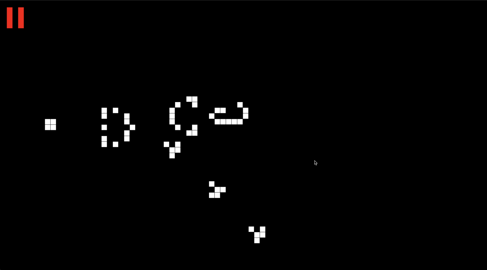

# Conway's Game of Life

Welcome to the Conway's Game of Life simulation built with JavaScript(Pixi.js) and React! This project visualizes the cellular automaton devised by mathematician John Horton Conway. The game is a zero-player game, meaning that its evolution is determined by its initial state, requiring no further input.

#### Click [here](https://ebinxavier.github.io/gameOfLife/) for live demo.



## Table of Contents

- [Introduction](#introduction)
- [Rules](#rules)

## Introduction

The Game of Life is a simple yet fascinating example of cellular automata. The game consists of a grid of cells which, based on a few mathematical rules, can live, die, or multiply. The game progresses through discrete time steps, updating the grid based on the states of neighboring cells.

## Rules

The game evolves according to the following rules:

1. **Underpopulation**: Any live cell with fewer than two live neighbors dies.
2. **Survival**: Any live cell with two or three live neighbors lives on to the next generation.
3. **Overpopulation**: Any live cell with more than three live neighbors dies.
4. **Reproduction**: Any dead cell with exactly three live neighbors becomes a live cell.

Thank you for checking out the Conway's Game of Life simulation. Have fun experimenting with different patterns and observing the fascinating outcomes!

### Deployment helper for gh-pages React + Vite apps.

1. Install Github Pages npm package

```bash
  npm install gh-pages --save-dev
```

2. Add homepages key to the `package.json`'s root level.

```json
"homepage": "https://ebinxavier.github.io/gameOfLife",
```

3. Add the following under `scripts` section of package.json

```json
    "predeploy": "npm run build",
    "deploy": "gh-pages -d build"
```

4. Update Vite configuration like this

```js
export default defineConfig({
  plugins: [react()],
  build: {
    outDir: "./build",
  },
  base: "/gameOfLife/",
});
```

5. run `npm run deploy`, it will deploy the application to github pages.
